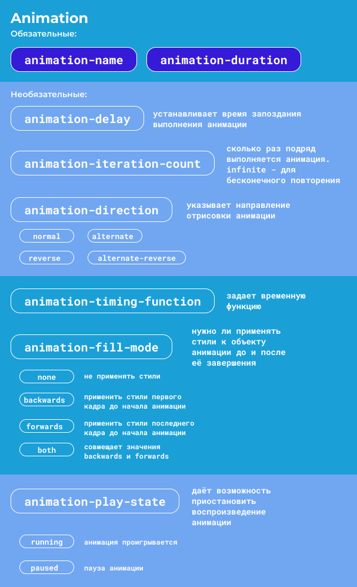

# CSS и JS-анимации
## Основы анимации

### Зачем нужны анимации?

- Работа с микровзаимодействиями
_Показать пользователю на что влияют его действия и что будет дальше. Микровзаимодействия определяют насколько удобно и приятно работать с сайтом_
- Обратная связь на действия пользователя

_Анимации используют для обратной связи на действия пользователя ( __hover__ , всплывающие подсказки, помощь при заполнении форм, плавные изменения состояний)_

- Отвлечение пользователя от загрузки страниц
- Управление вниманием. 
_Движение элементов привлекает к себе внимание._
- Отображение состояния интерфейса

- Анимации позволяют сгладить состояния, сделать переходы «бесшовными» и сайт воспринимается как единое целое.

- Визуализация данных (на графиках и съемах)

### Какого типа бывают анимации?

- CSS-анимации

Позволяют вращать, растягивать, уменьшать/увеличивать объект, перемещать и т.д.

Создают с помощью свойств animation. Они задают длительность анимации, количество повторений, зацикленность, стороны движения и другие характеристики. Можно создать при помощи свойства transition, но оно работает только при загрузке страницы, добавлении классов или изменении состояния (hover)

CSS-анимации можно запускать при загрузке страницы или при определенном действий, но для этого нужен JS.

Также можно влиять на SVG, например можно заставить контур постепенно появляться.

- SVG-анимации

Рисуется в редакторах

Правится в блокноте

Трактуется как DOM-элемент, т.е. с ним можно работать так же, как с другими элементами DOM (анимировать с помощью CSS и JS).

- JS-анимации

Подходит, если выше способы не подходят.

Пример: параллакс-эффект (когда при движении мыши элементы фона двигаются с разной скоростью)

Для сложных анимаций используют фреймворки Three.js, TweenMax, GSAP.

Минус: сайты с JS загружаются долго, могут работать медленно, но вызывают «вау-эффект».

- Canvas

Стандартный элемент HTML5, контейнер для графики. Чтобы нарисовать в нем элемент используется JS.

- WebGL

Используется для сложных эффектов и 3D-анимаций.

### База: CSS transition

CSStransition позволяет плавно менять исходное значение CSS на новое место вместо мгновенного переключения и управлять скоростью такого переключения.

CSStransition применяются ко всем элементам, в том числе к псевдоэлементам.

Невозможно анимировать свойства, у которых нет промежуточных состояний (display). Но вместо display можно использовать opacity или transform.

4 свойства для проставления анимации:

### С чего начать делать анимацию?

1. Найти все элементы для анимации

`.link {}`

2. Указать свойство для анимации

`.link {
transition-property:  opacity, background-color;
}`

3. Указать время выполнения анимации
`.link 
{
transition-property: opacity, background-color;
transition-duration: 0.3s
}`

4. Указать временную функцию
`.link {
transition-property: opacity, background-color; transition-duration: 0.3s;
transition-timing-function: ease;
}`

5. Указать продолжительность ожидания перед запуском
`.link {
transition-property: opacity, background-color; transition-duration: 0.3s;
transition-timing-function: ease;
transition-delay: 0.1s}`

6. Задать триггер для перехода
`.link:hover{
opacity: 0.6;
background-color: purple;
}`

### Принципы анимации

Принципы анимации используют для создания приятных, оптимизированных и уравновешенных эффектов.

Впервые 12 принципов анимации сформулировали аниматоры компании Disney Томас Фрэнк и Олли Джонстон в 1981 году. Сейчас их адаптировали для использования в веб-дизайне.

#### Важные принципы при создании анимации

- Смягчение начала и завершения движения (easein/ easeout). По закону физики – любое тело, обладающее массой, не может мгновенно начать движение, сразу набрать скорость и мгновенно завершить движение). Конечному пользователю приятнее видеть привычные движения, даже если это кнопка.
- Симметричные временные функции скучные. Плавный переход можно сделать интереснее, если в начале его немного ускорить, а в конец сделать протяжку. Для таких случаев можно использовать ease.
- Подготовка или упреждение – микродвижение, замах, который совершает объект, чтобы начать движение. Но чем плавнее движение, тем можно пренебречь этим правилом.
- Объемный рисунок – анимировать такие объекты необходимо с учетом их формы в трехмерном пространстве.

## CSS анимации по ховеру

transition-timing-function

**Графики временных функций**

**Гладкие временные функции**

Частые ошибки при создании простых анимаций

- Свойство transition отсутствует у основного селектора элемента

Свойство transition должно быть указано как свойство HTML-элемента. Мы не должны указывать его в псевдоклассе или только в доп.классе, который добавляем с помощью JS.

- При использовании псевдокласса :hover мы не должны забывать о состоянии :focus.

Если у элемента нет состояния фокуса, то используется tabindex = "0".
На этот html-элемент добавляем :focus-within. Этот псевдокласс определяет стиль элемента, когда он сам или элементы внутри него получают фокус. 
- Анимация с изменением размеров и положением элемента на странице. 
Может дергаться, поэтому рекомендуется обернуть в оболочку , она должна содержать всё оформление анимации.
-Влияние анимации элемента на окружающие его элементы
При разработки анимации на поля форм у нее может меняться ширина. Толщина border влияет на размер элемента. Рекомендуется заменить на box-shadow или outline.

### Примеры анимации с использованием дочерних элементов и псевдоэлементов
**clip-path**
Clip-path позволяет обрезать видимую область блока, нужно передать параметры того как и где обрезать. 

Чтобы обрезать прямоугольное изображение, можно использовать следующий код:
`.image {
    clip-path: circle(50%);
}`

Сайт, где можно попрактиковать clip-path на примерах: https://bennettfeely.com/clippy/

## Анимации без пользовательского взаимодействия
Покадровые анимации делаются с помощью @keyframes. Один кадр - один keyframes. Это правило и без инициирования оно не выполняется.
Чтобы правильно задать имя анимации, нужно знать несколько правил именования:

* только латинские буквы без учёта регистра;
* первый символ имени (без учёта дефиса) должен быть буквой — заглавной или строчной;
* можно использовать цифры;
* можно использовать знаки дефиса (-) и нижнего подчёркивания (_);
* нельзя ставить два дефиса подряд в начале имени;
* нельзя использовать специальные слова вроде inherit, none, initial, unset.

Ключевые кадры задаются в процентах от времени анимации. 
Можно их задавать с помощью ключевых слов **from**(0%) и **to**(100%).
`@keyframes example {
    from { color: #f00; }
    to { color: #0f0; }
}`
Можно задавать ключевые кадры в любом порядке. Можно перечислить через запятую. 

**Небольшие лайфхаки**
- На этапе изучения анимации не рекомендуется анимировать свойства, которые вызывают смещение других элементов (width, height, border, padding, margin). 
- Если требуется сместить элемент во время анимации, то вместо свойства position лучше подойдет transform: translate(). 
- width/heght -> transform: scale()
### Различия между animation и transition

### Смягчение начала и конца движения
Этот принцип нужен, чтобы перенести физику реального мира на интерфейсы. 
Чем тяжелее тело - тем больше усилий нужно, чтобы его разогнать. 

## Анимации с пользовательским интерфейсом
Плохая практика: добавлять оформление с помощью JS. Важно разделять оформление(CSS) и логику(JS). 
### События анимации
Для работы с анимациями есть ряд событий, которые помогают в их обработке.

Для css-переходов transition:

transitionstart — событие начала проигрывания анимации;

transitionrun — событие процесса проигрывания анимации;

transitioncancel — событие прерывания проигрывания анимации;

transitionend — событие окончания проигрывания анимации.

Для покадровых CSS-анимаций animation:

animationstart — событие начала проигрывания анимации;

animationiteration — событие проигрывания цикла анимации;

animationcancel — событие прерывания проигрывания анимации;

animationend — событие окончания проигрывания анимации.

https://up.htmlacademy.ru/animation-basics/1/module/4/item/2