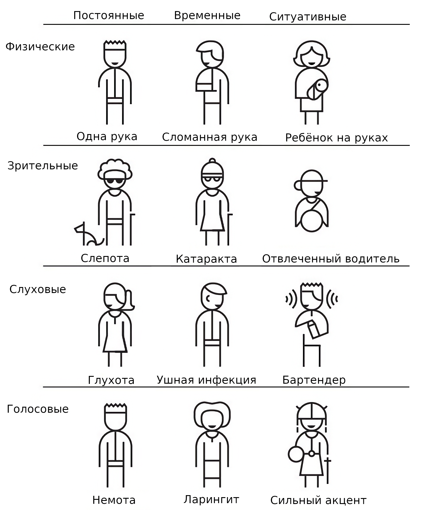

# Доступность веб-интерфейсов
## Ограниченные возможности и пользователи
Ограниченные возможности не всегда врожденные. Это могут быть временные ограничения: 
* Состояние здоровья: у многих людей есть болезни, которые влияют на концентрацию и выносливость. Такие пользователи не могут  долго работать за компьютером. 
* Временные ограничения: после коррекции зрения людям не рекомендуется несколько дней смотреть в экран
* Ситуативные ограничения: на солнце сложно прочитать текст
* Комбинация ограчений: человек не может видеть + пользуется одной рукой

### Категории ограчений
#### Слуховые
Глухота, глухота на одно ухо, слепоглухота. 
Какие могут быть препятствия: видео без субтитров, невозможность настроить субтитры, управление только голосом. 
#### Зрительные
Частичная или полная потеря зрения, нарушения зрения (близорукость, дальнозоркость), виды дальтонизма, повышенная чувствительность к свету. 
Возможные препятствия: 
* контент с недостаточной контрастностью
* контент где важная информация представлена в виде цвета (ссылку в тексте без подчеркивания будет сложно найти)
* негибкий контент, который нельзя использовать при изменении размера текста или стилей
* сайты, которые не поддерживают управление с клавиатуры
#### Голосовые
Речь не могут понять другие люди или голосовые ассистенты
Возможные препятствия:
* Сайты или приложения, которые используют только речь для выполнения действия или взаимодействия
* Сайты, которые оказывают сервис только по телефону
#### Физические
Двигательные нарушения (тремор, паралич, потеря координации), отсутствие конечностей
Возможные препятствия: 
* Сайты, которые не поддерживают управление с клавиатуры
* Интерфейсы, которые используют слишком маленькие элементы
* Сайты, где есть ограничения по времени (ограничение на заполнение формы)
* Сложные интерфейсы, где требуется слишком много сложных действий для пользователя для выполнения одной задачи
#### Когнитивные и неврологические
Возможные препятствия: 
* Сложные и непредсказуемые интерфейсы
* Сложный текст или слова без пояснений
* Длинные абзацы текста без поясняющих картинок. диаграм и прочего визуального контента
* Контент, который мигает и вызывает проблемы вестибулярного аппарата, а также аудио, которое нельзя отключить. 
